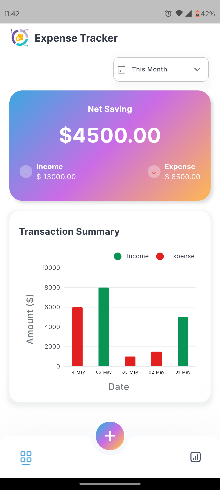

# Expense Tracker

Expense Tracker app built using **Flutter** and **Dart**. It implements the **Clean architecture** and uses **GetX** for efficient state management. The project also includes utility classes like **Helper**, **Validators**,**SizeUtils** for responsive design, **Extensions**, and various **Custom Widgets** for a cleaner, reusable, and maintainable codebase.

## Environment

 - Flutter 3.24.5
 - Dart 3.5.4

## Table of Contents

- [Features](#features)
- [Technologies](#technologies)
- [Architecture](#architecture)
- [Screenshots](#screenshots)

## Features

- **State Management**: Utilizes GetX for efficient state management, navigation, and binding.
- **Clean Architecture**: Clean separation of logic with Presentation, Domain and Data layer.
- **Responsive UI**: Custom utilities like `SizeUtils` ensure responsiveness across various screen sizes.
- **Custom Widgets**: Reusable custom widgets to maintain code reusability.
- **Extensions**: Handy Dart extensions to streamline and simplify the code.
  
## Technologies

- **Flutter**: The primary framework for building the mobile application.
- **Dart**: The programming language used to build the application.
- **GetX**: Used for state management, navigation, and dependency injection.
  
## Architecture

This project follows **Clean Architecture**, which separates concerns into distinct layers for better scalability, testability, and maintainability. Within this architecture, the MVC pattern is adapted for the presentation layer.

- **Data Layer**: Handles data access (e.g., API, local storage) and repositories.
- **Domain Layer**: Contains core business models, entities, and use cases.
- **Presentation Layer**: Implements a simplified **MVC** structure:
  - **View**: Renders the UI and presents data.
  - **Controller**: Manages user inputs, interacts with use cases, and updates the view.
  - **Bindings**: Connects the view and controller, ensuring reactive updates between them.

## Screenshots

